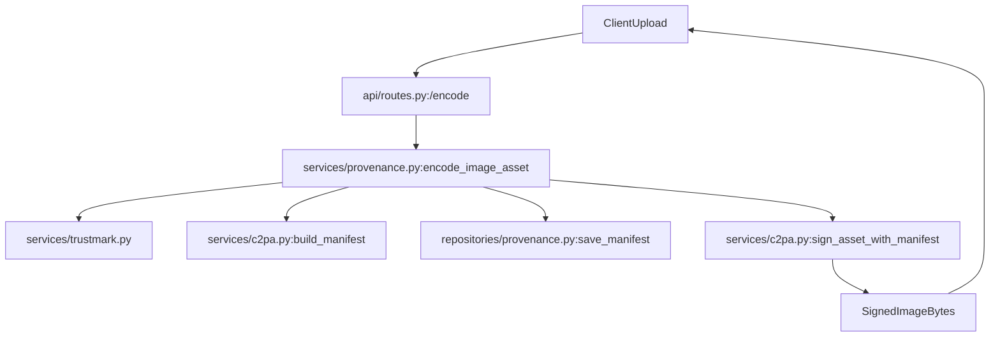
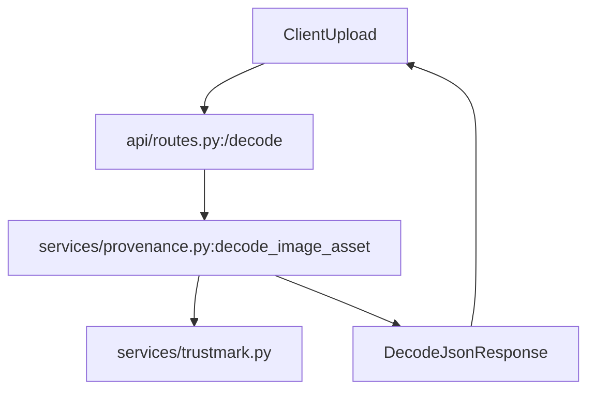

# Backend Developer Guide

## 1. 后端分层结构

当前后端采用的是“入口层 / API 层 / Service 层 / Repository 层 / Core/Utils 层”的轻量分层：

```text
backend/
├── app.py                      # Flask 应用入口
├── api/
│   └── routes.py               # HTTP 路由层
├── core/
│   └── config.py               # 全局配置
├── repositories/
│   └── provenance.py           # SQLite 持久化
├── services/
│   ├── provenance.py           # encode / decode / lookup 业务编排
│   ├── c2pa.py                 # C2PA manifest 构建与签名
│   └── trustmark.py            # TrustMark 初始化与 watermark ID 生成
└── utils/
    └── files.py                # 文件清理、MIME 等工具
```

职责边界可以简单理解为：

- `app.py`：创建 Flask app，注册蓝图
- `api/routes.py`：只处理请求校验、调用 service、返回响应
- `services/provenance.py`：把 TrustMark、C2PA、文件系统、仓储串起来
- `services/c2pa.py`：负责生成 manifest 和签名图片
- `repositories/provenance.py`：负责 SQLite
- `core/config.py`：统一放路径和配置
- `utils/files.py`：文件与 MIME 相关的辅助函数

## 2. 启动入口

应用入口很薄，只做初始化数据库、设置上传大小、注册路由：

```python
# backend/app.py
from flask import Flask
from flask_cors import CORS

from api.routes import provenance_bp
from core.config import MAX_CONTENT_LENGTH
from repositories.provenance import init_db


def create_app():
    init_db()

    app = Flask(__name__)
    app.config['MAX_CONTENT_LENGTH'] = MAX_CONTENT_LENGTH
    CORS(app)
    app.register_blueprint(provenance_bp)
    return app
```

## 3. 核心数据流概览

### `/encode`



### `/decode`



## 4. `/encode` 详细机制

### 4.1 路由层只做转发

```python
# backend/api/routes.py
@provenance_bp.route('/encode', methods=['POST'])
def encode_image():
    if 'image' not in request.files:
        return "No image file provided", 400

    file = request.files['image']
    if file.filename == '':
        return "No selected file", 400

    file_data, mimetype = encode_image_asset(
        file,
        request.form,
        request.files.getlist('ingredientImage')
    )
    return send_file(file_data, mimetype=mimetype)
```

真正的业务都在 `services/provenance.py`。

### 4.2 保存原图，生成带水印图

`encode_image_asset()` 先把上传的图存到 `backend/uploads/`，然后调用 TrustMark 对图片像素做不可见水印编码：

```python
# backend/services/provenance.py
input_path = os.path.join(UPLOAD_FOLDER, f"{base_filename}_original{file_ext}")
file_storage.save(input_path)

with Image.open(input_path) as cover:
    watermark_id = generate_watermark_id()
    rgb = cover.convert('RGB')
    encoded_image = trustmark.encode(rgb, watermark_id, MODE='binary', WM_STRENGTH=1.5)

    watermarked_path = os.path.join(OUTPUT_FOLDER, f"{base_filename}_watermarked.png")
    encoded_image.save(watermarked_path)
```

这里涉及两个关键点：

- `generate_watermark_id()` 会根据 TrustMark 当前 schema 容量生成一串二进制 watermark ID
- 真正的水印编码发生在 `trustmark.encode(...)`

TrustMark 是在 `services/trustmark.py` 里初始化成单例的：

```python
# backend/services/trustmark.py
TM_SCHEMA_CODE = TrustMark.Encoding.BCH_4
TRUSTMARK = TrustMark(verbose=True, model_type=TRUSTMARK_MODE, encoding_type=TM_SCHEMA_CODE)
```

### 4.3 构建 ingredient 列表

当前实现中：

- 用户上传的原图固定作为 `parentOf`
- 如果额外上传了 source/reference 图，这些 ingredient 默认作为 `inputTo`
- 对于 derivative 工作流，`inputTo` 表示“AI 生成/编辑时使用的输入素材”

```python
ingredient_definitions = [
    build_ingredient_definition(
        input_path,
        title=original_filename,
        relationship='parentOf',
    )
]

ingredient_relationship = normalize_ingredient_relationship(
    form_data.get('ingredientRelationship'),
    default='inputTo',
)
if ingredient_relationship == 'parentOf':
    ingredient_relationship = 'inputTo'
```

### 4.4 构建 C2PA manifest

`services/c2pa.py` 的 `build_manifest()` 会把前端表单和 ingredient 列表转成一个 JSON manifest 定义。

其中主要包含：

- `c2pa.soft-binding`
- `stds.schema-org.CreativeWork`
- `com.articulator.artwork-metadata`
- `com.articulator.derivation`
- `stds.iptc`
- `cawg.training-mining`
- `c2pa.actions.v2`

最重要的是 actions 的组织逻辑：

```python
if parent_ingredients:
    actions.append({
        'action': 'c2pa.opened',
        'parameters': {
            'ingredientIds': [parent_ingredients[0]['instance_id']],
        },
    })

if component_ingredients:
    actions.append({
        'action': 'c2pa.placed',
        'parameters': {
            'ingredientIds': [item['instance_id'] for item in component_ingredients],
        },
    })

created_parameters = {}
if input_ingredients:
    created_parameters['ingredientIds'] = [item['instance_id'] for item in input_ingredients]

actions.append({
    'action': 'c2pa.created',
    'parameters': created_parameters,
})
```

这表示：

- `parentOf` ingredient 通过 `c2pa.opened` 关联
- `componentOf` ingredient 通过 `c2pa.placed` 关联
- `inputTo` ingredient 通过 `c2pa.created.parameters.ingredientIds` 关联

当前实现不再额外写入 `c2pa.watermarked` 之类的非标准动作。  
TrustMark 的存在通过标准 `c2pa.soft-binding` assertion 表达，actions 只保留官方标准动作。

也就是说，对于 derivative 任务，原始参考图不会显示成“placed 进去的素材”，而是显示成“AI 计算输入”。

### 4.5 前端字段如何映射到 manifest

下面这些字段是当前 encode 链路里最关键的输入：

| 前端字段 | 后端消费位置 | 作用 |
| --- | --- | --- |
| `image` | `encode_image_asset()` | 主上传图片，既是水印写入对象，也是默认 `parentOf` ingredient 来源 |
| `ingredientImage[]` | `encode_image_asset()` | 额外素材图，通常作为 `inputTo` 或 `componentOf` |
| `title` | `build_manifest()` | manifest 标题、`c2pa.metadata` 与 CreativeWork 名称 |
| `author` | `build_manifest()` | `com.articulator.metadata` 中的 CreativeWork 作者 |
| `description` | `build_manifest()` | `com.articulator.metadata` 中的 CreativeWork 描述 |
| `assetDID` | `build_manifest()` | Raw W3C DID，写入两个 metadata assertions |
| `assetShortURL` | `build_manifest()` | DID short URL，统一规范化为 HTTPS |
| `canonicalURL` | `build_manifest()` | Articulator canonical URL |
| `maxDimension` | `encode_image_asset()` | 在 TrustMark/C2PA 签名前限制最终公开尺寸 |
| `artworkMetadata` | `build_manifest()` | 写入 `com.articulator.artwork-metadata` |
| `derivedFrom` | `encode_image_asset()` / `build_manifest()` | 派生来源说明，写入 `com.articulator.derivation` |
| `trainingPolicy` | `build_manifest()` | 写入 `cawg.training-mining` |
| `constraintInfo` | `build_manifest()` | 当 `trainingPolicy=constrained` 时补充限制信息 |
| `digitalSourceType` | `build_manifest()` | 写入 `c2pa.created.digitalSourceType` |
| `softwareAgent` | `build_manifest()` | 写入 claim generator / actions 的 software agent |
| `claimGeneratorVersion` | `build_manifest()` | software agent 版本 |
| `ingredientRelationship` | `encode_image_asset()` | 控制额外 ingredient 属于 `inputTo` 或 `componentOf` |

其中 `derivedFrom` 和 `artworkMetadata` 都要求前端传 JSON 字符串，后端会先 `json.loads(...)` 再嵌入 assertion。

新 active manifest 严格使用 C2PA 2.4 的 `c2pa.metadata` 和
`com.articulator.metadata`，不再生成 deprecated 的
`stds.schema-org.CreativeWork` 或 `stds.iptc`。`POST /add-asset-identity`
用于在不修改像素的前提下追加 UPDATE manifest，补齐 DID、short URL 和
canonical URL。

### 4.6 把 manifest 落库

构建完 manifest 后，后端会把它以 JSON 字符串形式保存到 SQLite：

```python
# backend/repositories/provenance.py
def save_manifest(watermark_id, manifest):
    manifest_json = json.dumps(manifest) if not isinstance(manifest, str) else manifest
    with get_connection() as conn:
        conn.execute(
            "REPLACE INTO provenance (watermark_id, manifest_json) VALUES (?, ?)",
            (watermark_id, manifest_json),
        )
```

这样做的目的有两个：

- 后续前端可以通过 watermark ID 回查 manifest
- 即使文件里的 C2PA metadata 被平台剥离，也还能走 Durable Content Credentials 的 fallback

### 4.7 把 manifest 签进图片

签名不是通过 shell 拼接命令完成的，而是通过 `c2pa-python` 的 Builder API：

```python
# backend/services/c2pa.py
builder = Builder.from_json(manifest)
for ingredient in ingredient_definitions:
    builder.add_ingredient(ingredient_json, guess_asset_format(ingredient['path']), ingredient_stream)

signer = build_c2pa_signer()
builder.sign(signer, guess_asset_format(source_path), source_stream, destination_stream)
```

签名证书和私钥目前来自：

- `c2pa/keys/es256_certs.pem`
- `c2pa/keys/es256_private.key`

注意：这套 key 当前是**测试证书**，不是生产证书。

## 5. `/decode` 详细机制

`/decode` 的目标现在只有一个：

- 图片像素中的 TrustMark watermark

### 5.1 先把上传文件保存到临时路径

```python
input_path = os.path.join(UPLOAD_FOLDER, f"{base_filename}_decode{file_ext}")
file_storage.save(input_path)
```

### 5.2 用 TrustMark 解码像素水印

`/decode` 不再负责解析文件中嵌入的 C2PA manifest。  
嵌入式 C2PA 的读取由前端 `c2pa` WebAssembly 库完成；后端 decode 只负责水印提取。

```python
stego_image = Image.open(input_path).convert('RGB')
wm_secret, wm_present, wm_schema = trustmark.decode(stego_image, MODE='binary')
return {
    'watermark': {
        'present': wm_present,
        'secret': wm_secret,
        'schema': wm_schema,
    }
}
```

### 5.3 返回统一 JSON

最终响应结构形如：

```json
{
  "watermark": {
    "present": true,
    "secret": "1010...",
    "schema": 2
  }
}
```

如果 TrustMark 解码失败，后端会返回：

```json
{
  "watermark": {
    "error": "..."
  }
}
```

这意味着 `/decode` 现在是一个纯粹的 watermark fallback 接口，不再承担 C2PA 解析职责。

## 6. `/lookup-by-watermark` 的作用

这是 Durable Content Credentials 的关键补全接口。

当前前端逻辑是：

1. 优先读取图片内嵌 C2PA
2. 如果文件内没有 C2PA，再走 `/decode`
3. 从图片像素里拿到 TrustMark watermark ID
4. 再调用 `/lookup-by-watermark` 从数据库里回查 manifest

对应仓储查询：

```python
def get_manifest_record(watermark_id):
    with get_connection() as conn:
        cursor = conn.cursor()
        cursor.execute(
            "SELECT manifest_json, verifiable_credential, vc_issued_at FROM provenance WHERE watermark_id = ?",
            (watermark_id,),
        )
        return cursor.fetchone()
```

所以数据库不是冗余存储，而是 DCC 场景下的核心恢复手段。

## 7. 当前依赖关系

### 7.1 `python/` 目录

`backend/services/trustmark.py` 当前直接从本地 `python/` 目录导入 TrustMark：

```python
sys.path.append(os.path.abspath(os.path.join(BACKEND_DIR, '../python')))
from trustmark import TrustMark
```

因此：

- `Watermark/python` 当前是**运行必需**
- 它不是单纯示例目录

### 7.2 `c2pa-python`

当前用于：

- 构建 manifest
- 添加 ingredients
- 把 manifest 签进输出图片
